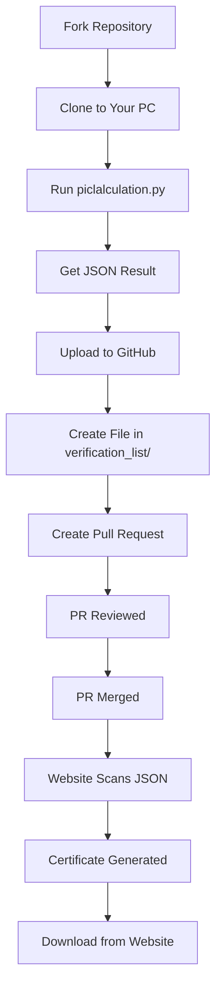

# 🔄 How It Works - Simple Flow

## The Complete Journey



---

## Step-by-Step Breakdown

### 1️⃣ Fork & Clone (2 minutes)

**What you do:**
- Fork the repository on GitHub
- Clone it to your computer

**Commands:**
```bash
git clone https://github.com/YOUR_USERNAME/pivalue.world.git
cd pivalue.world
```

---

### 2️⃣ Run Calculation Script (2-10 minutes)

**What you do:**
```bash
python piclalculation.py
```

**What happens:**
- Enter your GitHub username
- Choose time limit: 2, 5, or 10 minutes
- Your computer calculates 22/7 repeatedly
- Shows real-time progress
- Counts how many calculations you complete

**You can:**
- Stop early with Ctrl+C if needed
- Close other apps for better performance

---

### 3️⃣ Get Your Results (Instant)

**Script gives you:**
- ✅ Verification Code (16 characters)
- ✅ Submission ID (12 characters)
- ✅ JSON file: `pi_result_username.json`

**The JSON file is saved in:**
- Your local `verification_list/` folder
- Contains all your submission data

**Save these codes!** You need them for your PR.

---

### 4️⃣ Upload to GitHub (2 minutes)

**What you do:**
1. Go to YOUR fork on GitHub
2. Navigate to `verification_list/` folder
3. Click "Add file" → "Create new file"
4. Name it: `pi_result_YOUR_USERNAME.json`
5. Open the file on your computer
6. Copy the JSON content
7. Paste it into GitHub file editor
8. Click "Commit changes"

**No Git commands needed!** Just upload through GitHub UI.

---

### 5️⃣ Create Pull Request (2 minutes)

**What you do:**
1. After uploading, stay on GitHub
2. Click "Pull requests" tab
3. Click "New pull request"
4. Select: `base: main` ← `compare: your-branch`
5. Add title: `feat: add submission for YOUR_USERNAME`
6. Add description with your codes:
   ```
   Verification Code: XXXXXXXXXXXXXXXX
   Submission ID: XXXXXXXXXXXX
   ```
7. Click "Create pull request"

**Your PR is now submitted!**

---

### 6️⃣ Review & Merge (1-3 days)

**What maintainers do:**
- Check your submission
- Verify codes look valid
- Merge your PR

**You wait:**
- Usually takes 1-3 days
- Can check PR status anytime
- Get notification when merged

---

### 7️⃣ Automatic Verification (Instant)

**After merge:**
- Website auto-scans `verification_list/` folder
- Finds your JSON file
- Reads your Submission ID
- Validates Verification Code
- Marks as "Verified" in database

**No manual work needed!** It's all automatic.

---

### 8️⃣ Certificate Generation (Instant)

**Website automatically:**
- Creates beautiful certificate with:
  - Your GitHub username
  - Time limit achieved
  - Calculations performed
  - Precision digits
  - Unique codes
  - Pi Value World logo

---

### 9️⃣ Download Certificate (Anytime)

**You visit:** https://pivalue.iths.online/search

**Search by:**
- Submission ID
- GitHub username

**Download as:**
- PNG image
- PDF document

**Share on:**
- GitHub profile README
- LinkedIn
- Social media

---

## Timeline Summary

| Step | Time Needed | Who Does It |
|------|-------------|-------------|
| 1. Fork & Clone | 1 min | You |
| 2. Calculate | 2-10 min | You + Computer |
| 3. Get Results | Instant | Script |
| 4. Upload to GitHub | 2 min | You |
| 5. Create PR | 2 min | You |
| 6. Review | 1-3 days | Maintainers |
| 7. Verify | Instant | Website |
| 8. Download | Anytime | You |

**Total Active Time:** 7-17 minutes  
**Total Wait Time:** 1-3 days

---

## What Makes It Work?

### Behind the Scenes

**Git Magic:**
- Automatic branch creation
- Smart commit handling
- Push to correct remote

**Python Power:**
- High-precision decimal math
- Unique code generation
- JSON file handling

**Website Automation:**
- Scans GitHub merges
- Validates submissions
- Generates certificates
- Updates database

---

## Security & Validation

**What's Checked:**
- ✅ Valid GitHub username format
- ✅ Verification Code is 16 characters
- ✅ Submission ID is 12 characters
- ✅ Time limit is valid (2/5/10 min)
- ✅ Calculations match time spent
- ✅ No duplicate submissions

**What's Not Allowed:**
- ❌ Modifying calculation script
- ❌ Fake/fabricated results
- ❌ Multiple submissions same time
- ❌ Automated/bot calculations

---

## Common Questions

**Q: What if I close the script early?**  
A: Just run it again! No penalty.

**Q: Can I submit multiple times?**  
A: Once per time limit (can do 2min, 5min, and 10min separately)

**Q: What if PR is rejected?**  
A: Fix the issue and resubmit. Very rare!

**Q: How do I know it's verified?**  
A: Website shows green checkmark next to your submission.

**Q: Can anyone see my results?**  
A: Yes! All submissions are public on GitHub.

---

## Need Help?

**For issues:**
1. Check [README.md](README.md)
2. See [QUICKSTART.md](QUICKSTART.md)
3. Create GitHub issue

**Happy calculating!** 🥧
