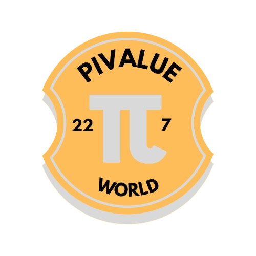

# 🥧 Pi Value World

<p align="center">
  
</p>

**The fun GitHub challenge where you calculate 22/7 and earn your unique Pi Certificate!**

[](https://opensource.org/licenses/MIT)
[](https://github.com/harinandsindukumar/pivalue.world/issues)
[](https://github.com/harinandsindukumar/pivalue.world/stargazers)

🌐 **Live Website:** [https://pivalue.iths.online](https://pivalue.iths.online)

**Created by:** [Harinand Sindukumar](https://github.com/harinandsindukumar/)  
**Contact:** harinand@iths.online | [iths.online](https://iths.online)

---

## 📖 About

Pi Value World is a fun, open-source project where developers worldwide test their PC power by calculating 22/7 (an approximation of π) within time limits. Earn a verified certificate showcasing your calculation prowess and add it to your GitHub profile!

### ✨ Features

- 🎯 **Challenge Yourself**: Calculate 22/7 for 2, 5, or 10 minutes
- 💪 **Test Your PC**: See how many calculations your computer can perform
- 🏆 **Earn Certificates**: Get a unique, verifiable certificate for your efforts
- 🌍 **Join Community**: See submissions from developers worldwide
- 📊 **Track Progress**: Monitor your calculation speed and precision

---

## 🚀 Quick Start (6 Super Simple Steps!)

### Step 1: Fork the Repository

```bash
# Click "Fork" button on GitHub at:
# https://github.com/harinandsindukumar/pivalue.world
```

### Step 2: Clone Your Fork

```bash
git clone https://github.com/YOUR_USERNAME/pivalue.world.git
cd pivalue.world
```

### Step 3: Create Your Branch (DO THIS FIRST!)

**IMMEDIATELY after cloning, create your submission branch:**

```bash
# Navigate into the cloned repository
cd pivalue.world

# Create and switch to a new branch for your submission
git checkout -b submission/YOUR_USERNAME-timestamp
```

**Example:**
```bash
cd pivalue.world
git checkout -b submission/harinandsindukumar-1711812345
```

**Why create a branch NOW?**
- ✅ Best practice in Git workflow
- ✅ Keeps main branch clean
- ✅ Required for submission acceptance
- ✅ Makes pull request creation easier
- ⚠️ **You CANNOT submit from main branch!**

**Verify you're on the correct branch:**
```bash
git branch
```
The `*` should show your new branch name, NOT `main`.

### Step 4: Run the Calculation Script

```bash
python src/piclalculation.py
```

**Requirements:**
- Python 3.6 or higher
- No external dependencies required!

### Step 5: Get Your Codes

1. Enter your GitHub username
2. Choose your time limit (2, 5, or 10 minutes)
3. Let the script calculate 22/7 repeatedly
4. **Auto-saves to verification_list/** ✅
5. **Save your Verification Code + Submission ID!** 🔑

### Step 6: Submit to GitHub (ONE COMMAND!)

**IMPORTANT: Make sure you're on your submission branch!**

```bash
# Check current branch
git branch
# Should show: * submission/yourname-timestamp

# If on main, switch to your branch first:
git checkout submission/YOUR_USERNAME-timestamp

# Then run submission
python submit_now.py
```

**What it does automatically:**
- 📝 **Adds files to git**
- 💾 **Commits changes**
- 🚀 **Pushes branch to GitHub**

**The script will check:**
- ✅ You're on a branch (not main)
- ✅ Files are ready to commit
- ✅ Everything pushes successfully

**⚠️ If you're on main branch, script will warn you!**

**Example output:**
```
📋 Current branch: submission/harinandsindukumar-1711812345
✅ Added 1 file(s)
✅ Committed successfully!
✅ Pushed to GitHub!
```

### Step 7: Create Pull Request & Get Certificate!

**After merge (1-3 days):**
- ✅ Website auto-verifies your submission
- ✅ Status: Not Verified → VERIFIED
- ✅ Download at: https://pivalue.iths.online/search

---

## 📋 How It Works

```
┌─────────────────┐
│  1. Fork Repo   │
└────────┬────────┘
         │
         ▼
┌─────────────────┐
│  2. Clone       │
└────────┬────────┘
         │
         ▼
┌─────────────────┐
│  3. Run Script  │ ───► Calculates 22/7 repeatedly
└────────┬────────┘      Records PC performance
         │
         ▼
┌─────────────────┐
│  4. Get Code    │ ───► Unique 16-char code + ID
└────────┬────────┘
         │
         ▼
┌─────────────────┐
│  5. CREATE      │ ───► git checkout -b
│     BRANCH      │      submission/username...
└────────┬────────┘
         │
         ▼
┌─────────────────┐
│  6. SUBMIT      │ ───► python submit_now.py
└────────┬────────┘      Adds, commits, pushes
         │
         ▼
┌─────────────────┐
│  7. CREATE PR   │ ───► On GitHub
└────────┬────────┘
         │
         ▼
┌─────────────────┐
│  8. After Merge │ ───► Auto-verify → Certificate!
└─────────────────┘
```

---

## 🎮 Example Output

```
============================================================
🥧 Welcome to Pi Value World! 🥧
============================================================

Calculate 22/7 and test your PC power!
Earn a unique certificate for your GitHub profile

Enter your GitHub username: harinandsindukumar

Select time limit:
1. 2 minutes
2. 5 minutes
3. 10 minutes

Enter choice (1/2/3): 2

🔢 Starting calculation for 2 minute(s)...
⏳ Press Ctrl+C to stop early

⚡ Calculations: 5000 | Elapsed: 45.23s
⚡ Calculations: 10000 | Elapsed: 90.45s
...

============================================================
🎉 Calculation Complete!
============================================================
👤 GitHub Username: harinandsindukumar
⏱️  Time Limit: 2 minute(s)
⚡ Actual Time: 120.00 seconds
🔢 Total Calculations: 13245
📊 Precision Achieved: 1000 decimal places

🎫 Your Verification Code: A1B2C3D4E5F6G7H8
🆔 Your Submission ID: abc123def456

💾 Results saved to: pi_result_harinandsindukumar.json

📋 Next Steps:
1. Copy your Verification Code and Submission ID
2. Run verify.py to submit
3. Wait for approval and receive your certificate!
```

---

## 🏆 Certificate Details

Each certificate includes:
- ✅ Your GitHub username
- ✅ Time limit chosen
- ✅ Number of calculations performed
- ✅ Precision achieved
- ✅ Unique verification code
- ✅ Submission ID
- ✅ Timestamp
- ✅ Official Pi Value World seal

**Certificate Formats:**
- Downloadable PNG image
- Shareable web link (perfect for GitHub profiles!)

---

## 🔍 Search & Verify

Anyone can verify certificates:
1. Visit [https://pivalue.world/search](https://pivalue.iths.online/search)
2. Enter the Submission ID
3. View complete details and authenticity

---

## 📜 Rules & Guidelines

### ✅ DO's
- Use your own computer for calculations
- Submit only one entry per time limit
- Be honest about your results
- Have fun and learn!

### ❌ DON'Ts
- Don't modify the calculation script
- Don't submit fake results
- Don't spam with multiple accounts
- Don't try to cheat the system

**Violations may result in disqualification and repository ban.**

---

## 🛡️ Security

We take authenticity seriously:
- All submissions are manually reviewed
- Anti-cheat validation checks timing
- Duplicate detection prevents spam
- GitHub account verification required

For security concerns, see our [Security Policy](SECURITY.md)

---

## 📄 License

This project is licensed under the MIT License - see the [LICENSE](LICENSE) file for details.

**TL;DR:** Do whatever you want, just give credit and don't sue us! 😄

---

## 🤝 Contributing

We welcome contributions! Please read our [Contributing Guidelines](CONTRIBUTING.md) first.

### Ways to Contribute:
- 🐛 Report bugs
- 💡 Suggest features
- 🎨 Improve UI/UX
- 📝 Fix typos
- 🔒 Enhance security

---

## 🌟 Leaderboard (Coming Soon!)

Top performers will be featured on our website. Think you have the fastest PC? Prove it! 🏃‍♂️💨

---

## 📞 Support

- **Issues:** [GitHub Issues](https://github.com/harinandsindukumar/pivalue.world/issues)
- **Email:** harinand@iths.online
- **Website:** https://iths.online
- **Discussions:** [GitHub Discussions](https://github.com/harinandsindukumar/pivalue.world/discussions)
- **Creator:** [Harinand Sindukumar](https://github.com/harinandsindukumar/)

---

## 🙏 Acknowledgments

Thanks to all contributors and participants who make Pi Value World possible!

**Created & Maintained by:**
- [@harinandsindukumar](https://github.com/harinandsindukumar/) - Harinand Sindukumar
- Contact: harinand@iths.online
- Website: https://iths.online

---

## 📊 Project Stats


---

## 🔗 Share This Project

Love this project? Star it on GitHub and share with your friends! ⭐

```
Made with ❤️ by the Pi Value World Community
© 2024 Pi Value World. All rights reserved.
```

---

<div align="center">

### 🥧 Keep Calculating! 🥧

**Current Pi Counter on Website: 3.14** (increments with each merge!)

[⬆ Back to Top](#-pi-value-world)

</div>
